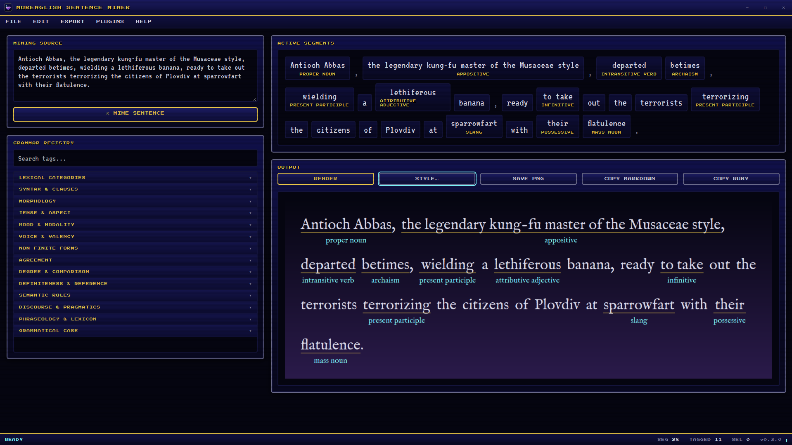
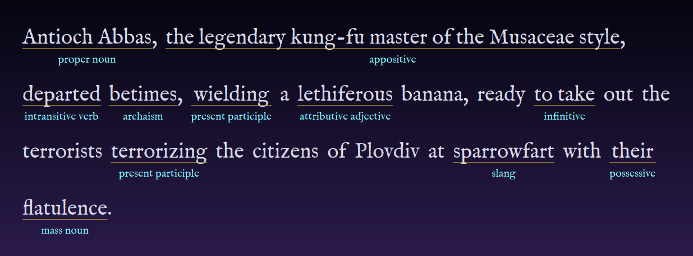
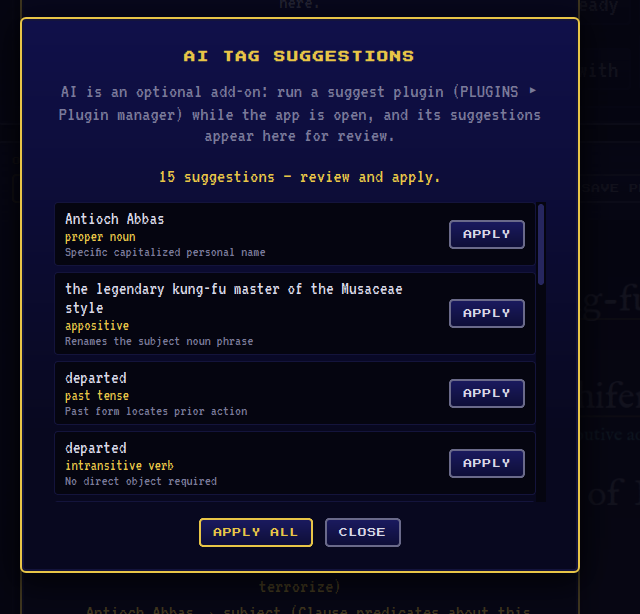
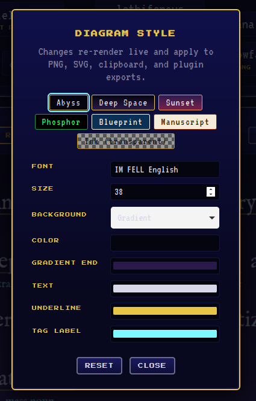
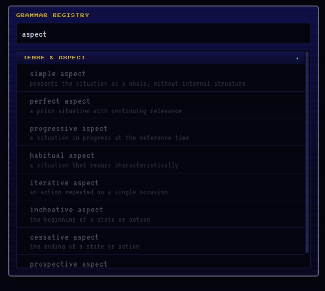
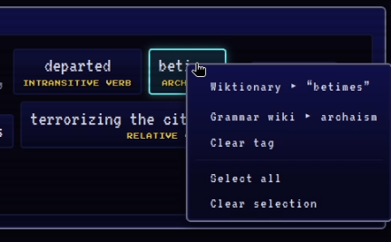
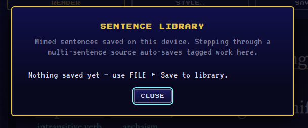

# MorEnglish Sentence Miner

Mine English sentences, tag their grammar, forge diagrams. A retro FF7-styled desktop app built with Tauri and vanilla HTML/CSS/JS.

**[▶ Try it in your browser](https://englishmoribund.github.io/MorEnglish_Sentence_Miner/)** — the same app, minus desktop-only features (plugins/AI, library, custom tags). [Download the desktop app](https://github.com/EnglishMoribund/MorEnglish_Sentence_Miner/releases/latest) for the full experience.



## Features

- **Mine** a sentence into word/punctuation segments
- **Tag** segments from a searchable registry of English grammar terms (parts of speech, syntax, morphology, tense/aspect, mood, semantic roles, and more) — select a range to merge words into one tagged block
- **Export** as a rendered PNG diagram (saved to Pictures), Markdown, or HTML ruby annotations
- **Look up** any word on Wiktionary or any grammar term on Wikipedia via right-click
- **Custom tags** via `registry.toml` in the app config dir (File ▸ Custom tags…)
- Undo (Ctrl+Z), autosaved sessions, keyboard-driven tagging (type in search, press Enter)

Exported diagrams use your chosen font and colors — this is the PNG the app saves, not a window capture:



## Screenshots

| | |
|---|---|
| AI tag suggestions from a plugin  | Diagram style presets and colors  |
| Searchable grammar registry  | Right-click lookups on any segment  |
| Sentence library  | |

## Development

Prerequisites: [Rust](https://rustup.rs/), [Node.js](https://nodejs.org/), and the [Tauri system dependencies](https://tauri.app/start/prerequisites/).

```sh
npm install
npm run dev     # run the app with hot reload
npm run build   # build release bundles
```

Rust tests: `cargo test` in `src-tauri/`.

## Recommended IDE Setup

- [VS Code](https://code.visualstudio.com/) + [Tauri](https://marketplace.visualstudio.com/items?itemName=tauri-apps.tauri-vscode) + [rust-analyzer](https://marketplace.visualstudio.com/items?itemName=rust-lang.rust-analyzer)
